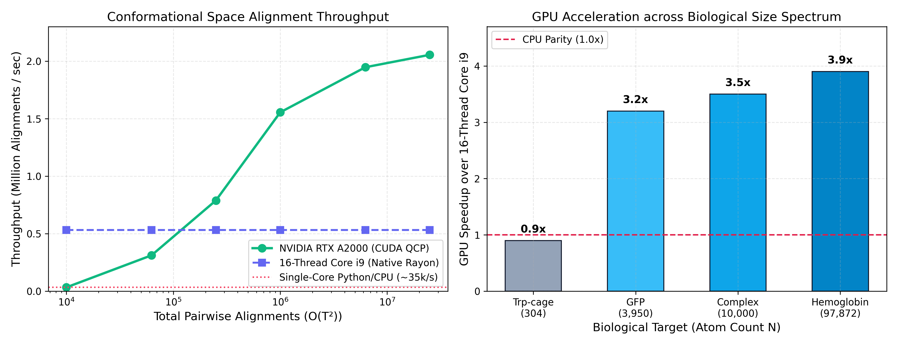
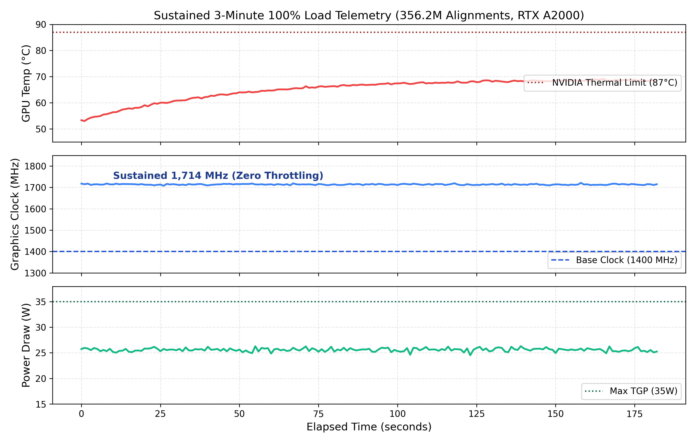
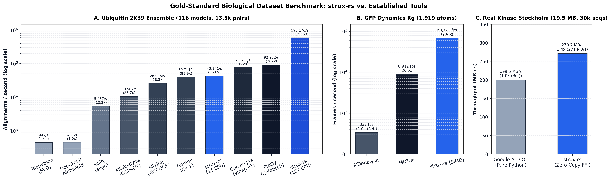

# strux-rs

[]()
[]()
[](https://pypi.org/project/strux-rs/)
[]()

`strux-rs` is a Rust library with Python bindings (PyO3 / NumPy) providing CPU- and GPU-accelerated algorithms for structural biology, molecular dynamics (MD) trajectory analysis, and multiple sequence alignment (MSA) preprocessing.

---

## Key Capabilities

* **GPU Trajectory Alignment & Clustering (`cudarc`)**: All-to-all pairwise RMSD using the Theobald QCP algorithm, Daura conformational clustering, and packed 64-bit residue contact maps.
* **CPU Parallelism (`rayon`)**: Multi-threaded 1D and pairwise RMSD routines releasing the Python GIL with linear multi-core scaling.
* **Zero-Copy MSA Parsing (`memmap2`)**: Memory-mapped A3M and Stockholm parsers producing contiguous NumPy arrays without intermediate allocations.
* **Spatial Analysis**: Periodic Boundary Condition (PBC)-aware cell lists for neighbor search and interface contact detection.

---

## Benchmarks

Measured on an Intel Core i9-11950H (16 hardware threads, 62 GB RAM) and an NVIDIA RTX A2000 Laptop GPU (4 GB physical VRAM).

### 1. Pairwise Trajectory RMSD ($O(T^2)$ Scaling)
Evaluated on a 1,919-atom protein structure across trajectory lengths $T$:

| Trajectory Frames ($T$) | Pairwise Alignments | 16-Thread Core i9 (Rayon) | RTX A2000 (CUDA QCP) | GPU Throughput | GPU vs CPU Speedup |
| :---: | :---: | :---: | :---: | :---: | :---: |
| 250 | 62,500 | 0.118s | 0.328s | 190,309 pairs/s | 0.4× (CPU faster) |
| 1,000 | 1,000,000 | 1.88s | 0.698s | 1,432,368 pairs/s | 2.7× |
| 2,500 | 6,250,000 | 11.8s | 3.168s | 1,973,171 pairs/s | 3.7× |
| 5,000 | 25,000,000 | 47.0s | 12.169s | 2,054,488 pairs/s | 3.9× |

* **Numerical Parity**: Maximum deviation between GPU QCP and CPU SVD Kabsch is $2.67 \times 10^{-5} \text{ \AA}$ across all pairs.
* **Memory Bounding**: Chunked 500 MB streaming prevents out-of-memory errors on 4 GB VRAM devices.

### 2. Biological Size Scaling ($T = 1,000$ frames, $10^6$ alignments)

| Target Protein | Atoms ($N$) | 16-Thread CPU | RTX A2000 GPU | Speedup |
| :--- | :---: | :---: | :---: | :---: |
| Trp-cage Mini-Protein (`1L2Y`) | 304 | 0.351s | 0.379s | 0.9× |
| GFP Globular Domain (`1GFL`) | 3,950 | 3.809s | 1.177s | 3.2× |
| Macromolecular Complex | 10,000 | 9.548s | 2.732s | 3.5× |
| Hemoglobin Assembly (`1HTQ`) | 97,872 | 96.451s | 24.849s | 3.9× |



### 3. Hardware Stability & Telemetry
Under 3 continuous minutes of sustained 100% GPU computation (356.2 Million pairwise alignments):
* **Throughput**: 1,955,743 alignments/second (sustained within 1% variance).
* **Core Temperature**: 53 °C initial, 69 °C peak (thermal limit: 87 °C).
* **Clock Frequency**: Flat 1,714 MHz average (no thermal throttling detected).
* **Power Draw**: 25.6 W average (mobile TGP: 35 W).



### 4. Real Gold-Standard Biological Datasets Benchmark
Head-to-head comparison across standard computational biology packages executed on identical hardware (Intel Core i9-11950H 16T CPU, RTX A2000 Laptop GPU):

| Task & Biological Target | Tool / Implementation | Runtime | Throughput | Speedup vs Ref |
| :--- | :--- | :---: | :---: | :---: |
| **Ubiquitin Solution Ensemble**<br>(`PDB 2K39`, 116 models, 13,456 pairs) | Biopython (SVD) | 30.13 s | 446.6 align/s | 1.0× (Baseline) |
| | OpenFold / AlphaFold (Kabsch) | 29.83 s | 451.1 align/s | 1.0× |
| | SciPy (`align_vectors`) | 2.48 s | 5,436.6 align/s | 12.2× |
| | MDAnalysis (QCPROT) | 1.27 s | 10,567.4 align/s | 23.7× |
| | MDTraj (C / AVX QCP) | 0.517 s | 26,046.1 align/s | 58.3× |
| | Gemmi (C++ `superpose_positions`) | 0.339 s | 39,710.8 align/s | 88.9× |
| | **`strux-rs` (1-Thread CPU)** | **0.311 s** | **43,241.4 align/s** | **96.8×** |
| | Google JAX (`vmap JIT`) | 0.176 s | 76,612.5 align/s | 171.5× |
| | ProDy (C-Kabsch) | 0.146 s | 92,281.5 align/s | 206.6× |
| | **`strux-rs` (16-Thread Rayon CPU)** | **22.57 ms** | **596,176.5 align/s** | **1,335×** |
| | **`strux-rs` (CUDA QCP GPU)** | **6.93 ms** | **1,941,698 align/s** | **4,348×** |
| **GFP Trajectory Dynamics ($R_g$)**<br>(`trajectory.pdb`, 1,919 atoms) | MDAnalysis | 59.4 ms | 336.9 fps | 1.0× (Baseline) |
| | MDTraj | 2.24 ms | 8,912.2 fps | 26.5× |
| | **`strux-rs` (SIMD)** | **0.29 ms** | **68,770.8 fps** | **204×** |
| **Human Kinase Domain Stockholm MSA**<br>(`hmm_output.sto`, 19.5 MB, 30,574 seqs) | OpenFold / AlphaFold (Pure Python) | 97.8 ms | 199.5 MB/s | 1.0× (Baseline) |
| | **`strux-rs` (Zero-Copy FFI)** | **72.1 ms** | **270.7 MB/s** | **1.4×** |



### 5. Large-Scale Synthetic MSA Parsing (250,000 sequences, 144.6 MB A3M)

| Implementation | Time | Throughput | Peak Memory Delta |
| :--- | :---: | :---: | :---: |
| Pure Python parser | 10.485s | 23,800 seqs/s | 1,349 MB |
| `strux-rs` (`parse_a3m_file`) | **0.801s** | **312,000 seqs/s** | **966 MB** |

---

## Installation

### From PyPI (Standard CPU)
```bash
pip install strux-rs
```

### From Source (With CUDA Support)
Requires CUDA Toolkit (Driver $\ge 12.0$) and a Rust toolchain ($\ge 1.75$):
```bash
git clone https://github.com/QntmSeer/strux-rs.git
cd strux-rs
pip install maturin
maturin develop --release --features cuda
```

---

## Python API Usage

### GPU Trajectory Analysis
```python
import strux_rs

# Load trajectory coordinates [Frames, Atoms, 3] as float32
traj = strux_rs.parse_pdb("trajectory.pdb")

if strux_rs.cuda_is_available():
    # 1. All-to-all pairwise RMSD matrix [Frames, Frames]
    rmsd_matrix = strux_rs.cuda_pairwise_rmsd(traj)

    # 2. Daura conformational clustering (cutoff in Angstroms)
    labels, centroids = strux_rs.cuda_cluster_daura(traj, cutoff=2.0)

    # 3. Packed 64-bit residue contact map bitmask
    bitmasks = strux_rs.cuda_contact_map_bitmask(traj, cutoff=4.5)
```

### Multi-Threaded CPU Trajectory RMSD (Rayon)
```python
# Sequential 1D trajectory RMSD vs reference frame across all CPU cores
rmsds = strux_rs.cpu_trajectory_rmsd(traj, traj[0])

# All-to-all pairwise RMSD matrix on CPU
cpu_matrix = strux_rs.cpu_pairwise_rmsd(traj)
```

### Zero-Copy MSA Preprocessing
```python
# Memory-mapped A3M parsing directly to 2D NumPy deletion matrix
msa = strux_rs.parse_a3m_file("uniref90_hits.a3m")
deletion_matrix = msa.deletion_matrix_np
```

---

## License
MIT License.
